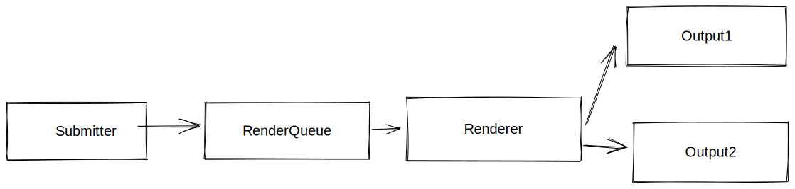

# Map System

Map system is a scheme of classes and templates with the porpouse of describing a map.

As requisite we should achieve a compact data layout and a fast access elements (using SparseSet).

We will Define some concept elements:

* **RegId**, RegId is an int dressed of enum class, and its mission is to create a relation between multiple SparseSets, the way that a same RegId between multiple sets can represents a whole (actor -refId- and components -sets elements-). RegId Should be managed using **RegIdManager**.
* **RegData**, RegData represents conjunction of related classes data. RegData manages each class separately using a SparseSets system (**TypeRegMap**). \
  e.g all components should be included in the same **RegData**. Also **RegData** use **RegId** for elements conjunction.
* **MapLevel**, Most high level class of the system, MapLevel is the final interface, Map level defines which RegData, with which classes and how data will be operated. MapLevel can create any objects that appears in a map.

## Rendering

Map systems should submit geometry data using RenderSubmitter, later the associated render thread will take each job in the pool to make a render.

