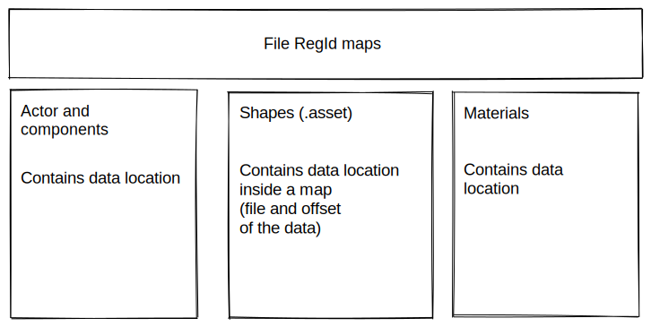

# Register

## RegIdManager

Each RegIdManager is a collection of unique Ids, RegIdManager can create unique Ids.

Ids should be unique for collections, e.g Mesh and Curve should be a collection with unique ids.

## RegId

## Engine Reg types

## Buffered maps and File maps
